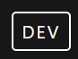
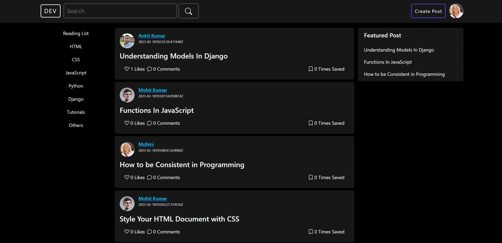

<a name="readme-top"></a>

<!-- PROJECT LOGO -->
<br />
<div align="center">

  

  <p align="center"> 
    A dev.to clone that incorporates the majority of its features,
    allowing users to create profiles, publish articles, interact with other users through comments and reactions.
    <br />
    <br/>
    <a href="https://django-devblogs.vercel.app/">Live Site</a>
    ·
    <a href="https://github.com/ankitdevelops/devblogs/issues">Report Bug</a>
    ·
    <a href="https://github.com/ankitdevelops/devblogs/issues">Request Feature</a>
  </p>
</div>

<!-- TABLE OF CONTENTS -->
<details>
  <summary>Table of Contents</summary>
  <ol>
    <li>
      <a href="#about-the-project">About The Project</a>
      <ul>
        <li><a href="#built-with">Built With</a></li>
      </ul>
    </li>
    <li>
      <a href="#getting-started">Getting Started</a>
      <ul>
        <li><a href="#prerequisites">Prerequisites</a></li>
        <li><a href="#installation">Installation</a></li>
      </ul>
    </li>
    <li><a href="#license">License</a></li>
    <li><a href="#contact">Contact</a></li>

  </ol>
</details>

<!-- ABOUT THE PROJECT -->

## About The Project

 <a href="https://django-devblogs.vercel.app/">
    
  </a>

A dev.to clone that incorporates the majority of its features,
allowing users to create profiles, publish articles, interact with other users through comments and reactions.

<p align="right">(<a href="#readme-top">back to top</a>)</p>

## Built With


**_DB DESIGN_**
 

<p align="right">(<a href="#readme-top">back to top</a>)</p>

<!-- GETTING STARTED -->

## Getting Started

To get a local copy up and running follow these steps.

### Prerequisites

You need `NodeJs` and `Python` installed on your machine.

### Installation

 Clone the repo
   ```sh
   git clone https://github.com/ankitdevelops/devblogs.git
   ```
 **_Setting Up the Backend_**
   ```sh
   cd backend  
   ```
Create a virtual environment and install the dependencies

```sh
virtualenv env
pip install -r requirements.txt

# or only if using pipenv

pipenv shell
pipenv install
```
Start the Django Development Server

```sh
python manage.py collectstatic #only if needed
python manage.py makemigrations #only if needed
python manage.py migrate #only if needed
python manage.py runserver
```
 **_Setting Up the Frontend_**

 ```sh
 cd frontend
 ```
 Install dependencies from package.json and start the server
 ```sh
 npm install
 npm start 
 ```

<p align="right">(<a href="#readme-top">back to top</a>)</p>


## License

Distributed under the MIT License. See `LICENSE.md` for more information.

<p align="right">(<a href="#readme-top">back to top</a>)</p>

<!-- CONTACT -->

## Contact

Ankit Kumar - [@linkedin/helloankit](https://www.linkedin.com/in/helloankit/)

Project Link: [https://django-devblogs.vercel.app/](https://django-devblogs.vercel.app/)

<p align="right">(<a href="#readme-top">back to top</a>)</p>
<!-- MARKDOWN LINKS & IMAGES -->
<!-- https://www.markdownguide.org/basic-syntax/#reference-style-links -->

**_Read more_**

[](https://dev.to/ankitdevelops/introducing-devblogs-22b6) 