## DevBlogs
*Trying to make clone of dev.to*

## TechStack
- Python
- Django
- DjangoRestFramework
- React
- Bootstrap

## Current Feature
- No support of light mode
- SignUp
- SignIn
- Post Listing
- Post Creating
- Post Details
- Post Updating
- User Profile
- Comments
- Category Filtering
- Featured Post
- Search
- Post Like/Unlike
- Post Saving
- Dashboard to manage posts(Edit,delete,archive)

## Screenshots

## DB Design
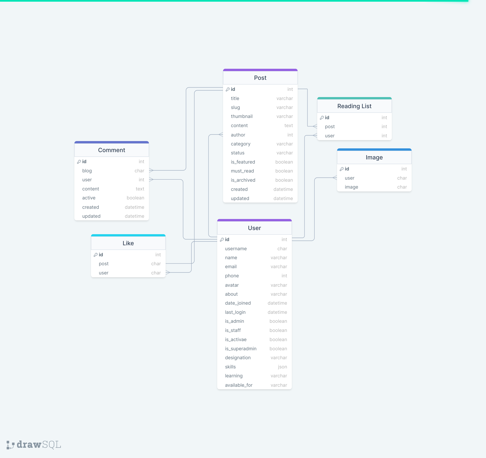

### SignUp Page
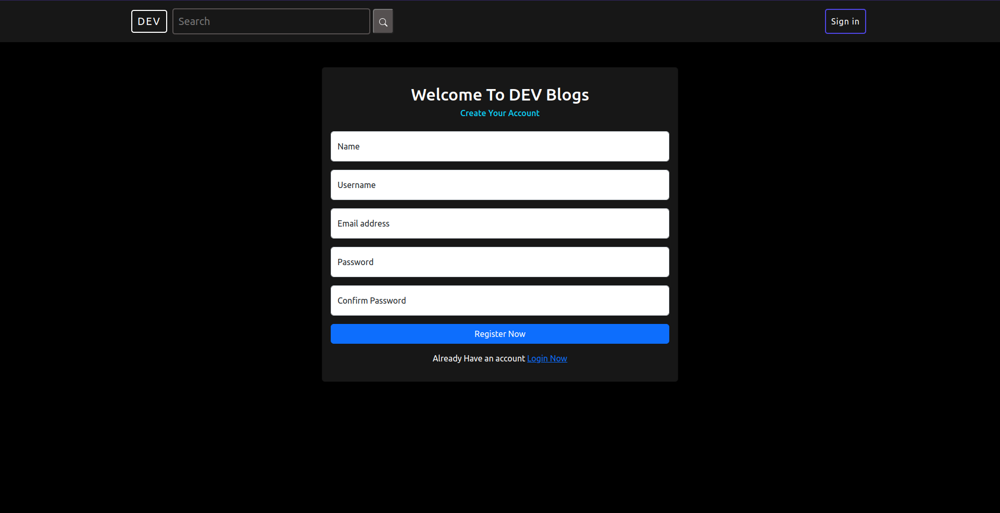

### SignIn Page
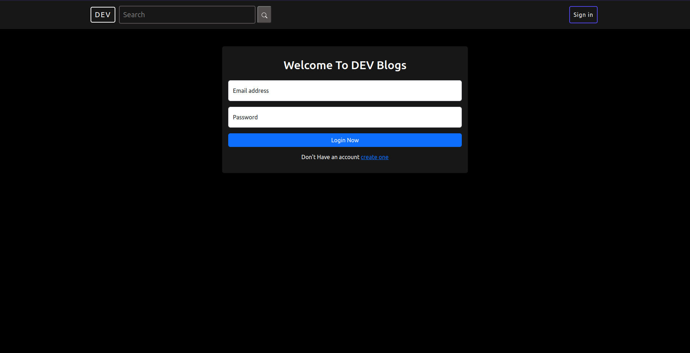

### HomePage
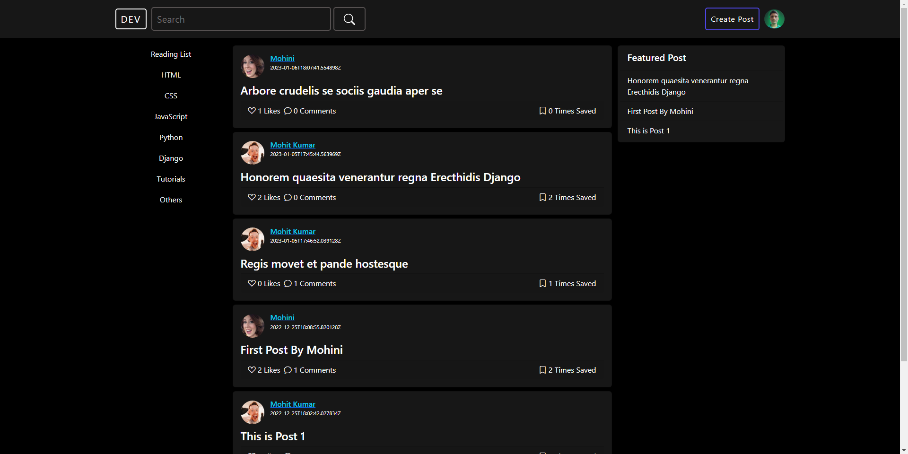

### Details Page
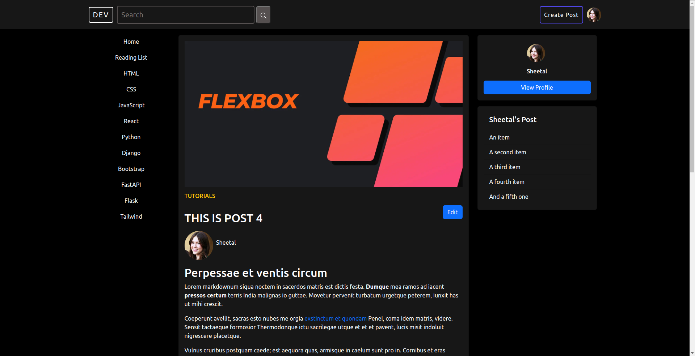

### Create Page
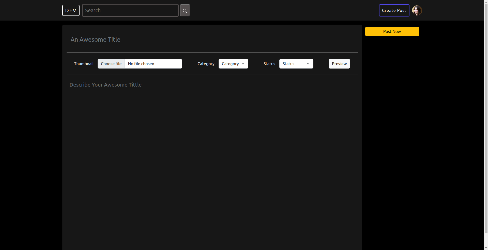

### Edit Page
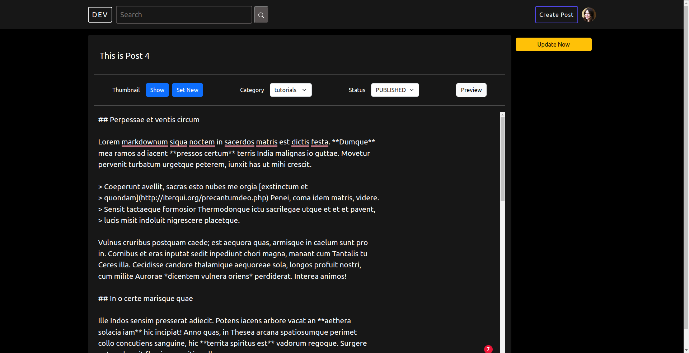

### UserProfile Page
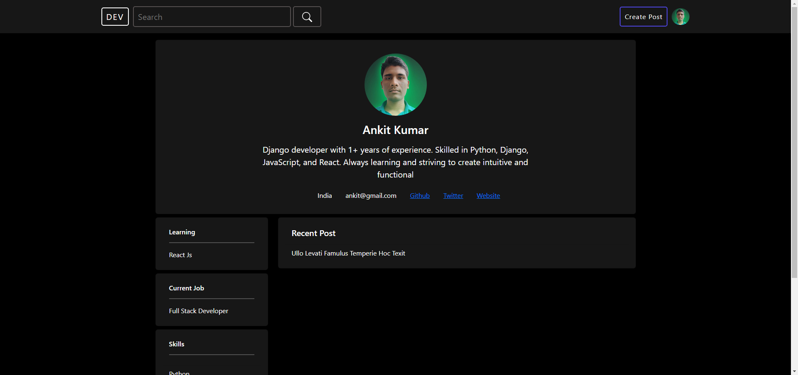

### Dashboard
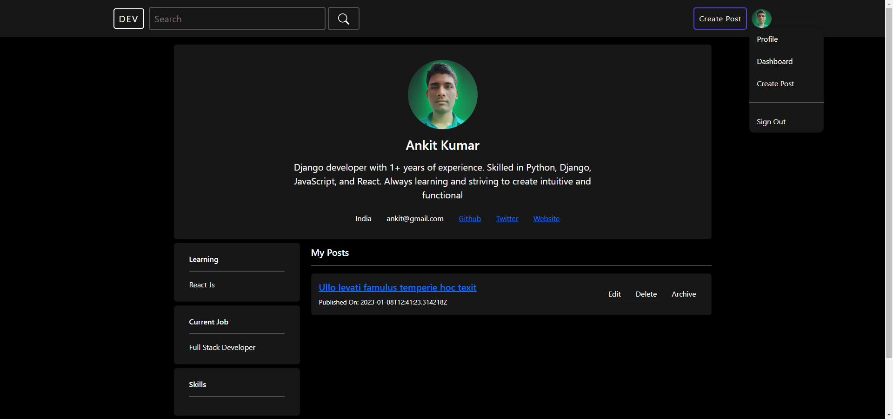

### Post Like
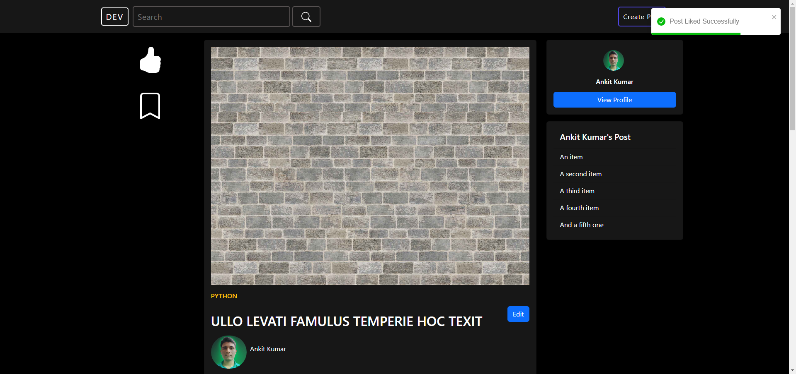

### Post Save
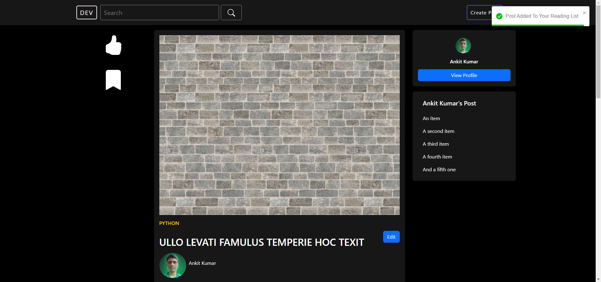